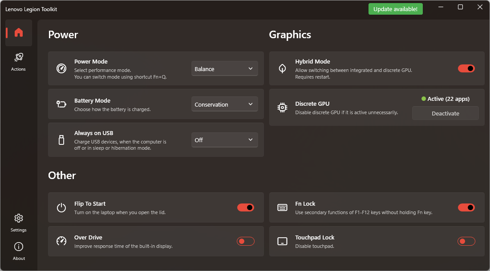

# Lenovo Legion Toolkit

This is a small utility created for Lenovo Legion laptops, that allows to change a couple of features that are only available in Lenovo Vantage.

It is a single executable app that needs no installation and runs no background services. It uses less memory, virtually no CPU and contains no telemetry.

## Disclaimer

This is a hobby project. I want to make it available on more devices, but it will take some time, so please be patient and read through this readme carefully.

The tool comes with no warranty. Use at you own risk.

## Compatibility

All testing done by me is done always on latest Windows 11 update and Legion 5 Pro 16ACH6H. I already know that there are some strange differences between Windows 10 and 11 that are not document very well, but I do my best to correct bugs like this as soon as possible.

Toolkit is compatible with a lot of Legion laptops from 2020 and 2021. Full list of supported models can be found here: [Compatibility.cs](https://github.com/BartoszCichecki/LenovoLegionToolkit/blob/master/LenovoLegionToolkit.Lib/Utils/Compatibility.cs).

If you are getting an incompatible message on startup, you can check *Contribution* section down at the bottom, to see how can you help.

## Features

The app allows to:

* Switching between Quiet, Balance and Performance modes, including changing Windows power plans,
* Enabling and disabling Hybrid Mode,
* Changing Battery charging options: conservation, rapid charging and normal charging,
* Always on USB charge settings: on, off and on when sleeping,
* Flip to start, Over Drive, Fn and Touchpad locks,
* Disable/enable Lenovo Vantage without uninstalling it,
* Deactivate discrete GPU (nVidia only).
* Change display refresh rate (buil in display only).
* Set up custom power plans for specific Power Modes.

#### Disable/enable Lenovo Vantage

This app allows you to disable Lenovo Vantage without uninstalling it. It it especially useful, you want to keep Vantage around i.e. for checking updates.

You can do it from the Tools menu on top. If you disable Vantage, it will stop and disable it's services, and disable all funky Lenovo Scheduled tasks. Once Vantage is disabled, it will no longer start any background processes on startup. If you want to open Lenovo Vantage, you need to re-enable it from the tool, otherwise it will prompt to reinstall itself.

#### Deactivate discrete GPU

Sometimes discrete GPU stays active even when it should not. This can happen for example, if you work with external screen and you disconnect it - some processes will keep running on discrete GPU keeping it alive and shortening battery life.

This app allows you to deactivate discrete GPU, forcing all processes to move to integrated GPU and allowing discrete GPU to turn off and extend battery life. Toolkit will show you if the dGPU is active and how many processes run on it. If you hover mouse over the GPU status it, tooltip will contain list of active processes.

Deactive button will be enabled when dGPU is active, you have Hybrid mode enabled and there are no screens connected to dGPU.

Keep in mind that some apps may not like this feature and crash, when you deactivate dGPU.

#### Windows Power Plans

Toolkit will automatically switch Windows power plans when Power Mode changes _and_ when Lenovo Vantage is disabled.

On some laptops though, Lenovo Vantage never switched power plans. If you have one of the laptops where Lenovo Vantage does not change Windows power plans automatically you can override this behavior in `Tools -> More settings -> Activate power plans even when Vantage is enabled`. This will allow Toolkit to always change Windows power plans, even if Lenovo Vantage is running in the background.

## Installation

Lenovo Legion Toolkit is a single executable app, which means it does not need to be installed. It can be downloaded from [Releases](https://github.com/BartoszCichecki/LenovoLegionToolkit/releases) page (look to the right).

Similarly when there is an update available, you just download the newer exe, and replace the one you have. Just make sure that you close Toolkit (and it's not running in tray).

## Requirements

This tool is written with .NET 5 which means you need to have **.NET Desktop Runtime 5**. You can get it from here:

https://dotnet.microsoft.com/download/dotnet/5.0/runtime

You don't need to install it if you already have the .NET SDK 5 installed.

## Credits

Credits go to [ViRb3](https://github.com/ViRb3), for creating [Lenovo Controller](https://github.com/ViRb3/LenovoController), which was used as a base for this tool. 

Special thanks to [falahati](https://github.com/falahati), for creating [NvAPIWrapper](https://github.com/falahati/NvAPIWrapper) and [WindowsDisplayAPI](https://github.com/falahati/WindowsDisplayAPI).

## Contribution

I appreciate any feedback that you have, so please do not hesitate to report issues. PRs are also welcome!

#### Bugs

If you find any bugs in the app, please report them. It will be very helpful if you start the app with `--trace` parameter and reproduce the issue. You can find logs in `%LOCALAPPDATA%\LenovoLegionToolkit\log`. Of course attach the latest log to the issue here on GitHub.

Just, don't run with this parameter all the time, it creates a ***really large*** amount of logs.

#### Compatibility

It would be great to expand the list of compatible devices, but to do it your help is needed!

If you are willing to check if this app works correctly on your device that is currently unsupported, you can do it by starting the app with ``--skip-compat-check`` argument. Remember that some functions may not function properly, so keep this in mind.

If you do it, I would really appreciate if you create an issue here on GitHub with the results of your testing. Make sure to include following information in your issue:

1. Full model name (i.e. Legion 5 Pro 16ACH6H)
2. List of features that are working as expected.
3. List of features that seem to not work.
4. List of features that crash the app.

The more info you add, the better the app will get over time.

Thanks in advance!
