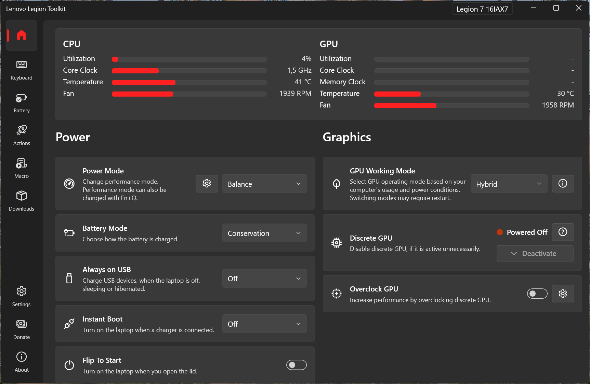

# Lenovo Legion Toolkit

[](https://github.com/BartoszCichecki/LenovoLegionToolkit/actions/workflows/build.yml)
[](https://crowdin.com/project/llt)
[](https://discord.com/invite/legionseries)
<a href="https://hellogithub.com/repository/dd55be3ac0c146208259f17b29d2162f" target="_blank"></a>

---

#### Other language versions of this README file:
* [简体中文版简介](README_zh-hans.md)
* [日本語版のREADME](README_ja-JP.md)

---


Support the Armed Forces of Ukraine and People Affected by Russia’s Aggression on UNITED24, the official fundraising platform of Ukraine: https://u24.gov.ua.

**Слава Україні!**


<br />

Lenovo Legion Toolkit (LLT) is a utility created for Lenovo Legion (and similar) series laptops, that allows changing a couple of features that are only available in Lenovo Vantage or Legion Zone.

It runs no background services, uses less memory, uses virtually no CPU, and contains no telemetry. Just like Lenovo Vantage, this application is Windows only.

_Join the Legion Series Discord: https://discord.com/invite/legionseries!_



&nbsp;

# Table of Contents
  - [Disclaimer](#disclaimer)
  - [Download](#download)
  - [Compatibility](#compatibility)
  - [Features](#features)
  - [Donate](#donate)
  - [Credits](#credits)
  - [FAQ](#faq)
  - [Arguments](#arguments)
  - [How to collect logs?](#how-to-collect-logs)
  - [Contribution](#contribution)

## Disclaimer

**The tool comes with no warranty. Use at your own risk.**

Please be patient and read through this readme carefully - it contains important information.

## Download

You can download the program by the following ways:

- Manually from the [Releases page](https://github.com/BartoszCichecki/LenovoLegionToolkit/releases/latest)
- Using [winget](https://github.com/microsoft/winget-cli):

  ```sh
  winget install BartoszCichecki.LenovoLegionToolkit
  ```

- Using [Scoop](https://scoop.sh):

  ```sh
  scoop bucket add versions
  ```

  ```sh
  scoop bucket add extras
  ```
  
  ```sh
  scoop install extras/lenovolegiontoolkit
  ```
  
> [!TIP]
> If you are looking for a Vantage alternative for Linux, check [LenovoLegionLinux](https://github.com/johnfanv2/LenovoLegionLinux) project out.

#### Next steps

LLT works best when it's running in the background, so go to Settings and enable _Autorun_ and _Minimize on close_. Next thing is to either disable Vantage and Hotkeys or just uninstall them. After that LLT will always run on startup and will take over all functions that were handled by Vantage and Hotkeys.

> [!WARNING]
> If you close LLT completely some functions will not work, like synchronizing Windows Power Modes or Windows Power Plans with current Power Mode, Macros or Actions. This is due to the fact that LLT does not run any background services and won't be able to respond to changes.

#### Required drivers

If you installed LLT on a clean Windows install, make sure to have necessary drivers installed. If drivers are missing, some options might not be available. Especially make sure that these two are installed on your system:
1. Lenovo Energy Management
2. Lenovo Vantage Gaming Feature Driver

#### Problems with .NET?

If for whatever reason LLT installer did not setup .NET properly:
1. Go to https://dotnet.microsoft.com/en-us/download/dotnet/8.0
2. Find section ".NET Desktop Runtime"
3. Download x64 Windows installer
4. Run the installer

> [!NOTE]
> If you installed LLT from Scoop, .NET 8 should have been installed automatically as a dependency. If anything fails, use `scoop update` to update all packages and try to reinstall LLT with `--force` argument.

After following these steps, you can open Terminal and type: `dotnet --info`. In the output look for section `.NET runtimes installed`, in this section you should see something like:

`Microsoft.NETCore.App 8.0.0 [C:\Program Files\dotnet\shared\Microsoft.NETCore.App]`

and

`Microsoft.WindowsDesktop.App 8.0.0 [C:\Program Files\dotnet\shared\Microsoft.WindowsDesktop.App]`

The exact version number can be different, but as long as it is `8.x.x` it should be fine. If after these steps LLT still shows an error on startup that .NET couldn't be found or similar, the problem is on your machine and not with LLT.

#### Want to help with testing?

Join the [Legion Series Discord](https://discord.com/invite/legionseries) and head to `#legion-toolkit` channel. Beta versions of future releases are posted there frequently!

## Compatibility

Lenovo Legion Toolkit is made for Lenovo Legion laptops, and other similar laptops like Ideapad Gaming, LOQ and their Chinese variants.

Generations 6 (MY2021), 7 (MY2022) and 8 (MY2023) are supported, although some features also work on the 5th generation (MY2020). Issues related to devices older than Gen 6 or that are not Legions are out of scope of this project.

If you are getting an incompatible message on startup, you can check the *Contribution* section down at the bottom, to see how can you help. Keep in mind, that not always I can make all options compatible with all hardware since I do not have access to it.

**Support for other laptops is not planned.**

### Lenovo's software

Overall the recommendation is to disable or uninstall Vantage, Hotkeys and Legion Zone while using LLT. There are some functions that cause conflicts or may not work properly when LLT is working along side other Lenovo apps.

> [!TIP]
> Using the disable option in LLT is often the easiest option.

### Other remarks

LLT currently does not support installation for multiple users, so if you need to have multiple users on you laptop you might encounter issues. Same goes for accounts without Administrator rights - LLT needs an account with Administrator rights. If you install LLT on an account without such rights, LLT will not work properly.

## Features

The app allows to:

- Change settings like power mode, battery charging mode, etc. that are available only through Vantage.
- Spectrum RGB, 4-zone RGB and White backlight keyboards support.
- Monitor dGPU activity (NVIDIA only).
- Define Actions that will run when the laptop is i.e. connected to AC power.
- View battery statistics.
- Control laptop features from command line
- Check for driver and software updates.
- Check warranty status.
- Disable/enable Lenovo Vantage, Legion Zone and Lenovo Hotkeys service without uninstalling them.
- ... and more!

### Custom Mode

Custom Mode is available on all devices that support it. You can find it in the Power Mode dropdown as it basically is 4th power mode and it allows for adjusting power limits and fans. Custom Mode can't be accessed with Fn+Q shortcut. Not all features of Custom Mode are supported by all devices.

If you have one of the following BIOSes:
* G9CN (24 or higher)
* GKCN (46 or higher)
* H1CN (39 or higher)
* HACN (31 or higher)
* HHCN (20 or higher)

Make sure to update it to at least minimum version mentioned above for Custom Mode to function properly.

### RGB and lighting

Both Spectrum per-key RGB and 4-zone RGB backlight is supported. Vantage and it's services need to be disabled to avoid conflicts when communicating with hardware. If you use other RGB apps that might conflict with LLT, check [FAQ](#faq) for solutions.

Other lighting features like both 1 and 3 level white keyboard backlight, panel logo and rear ports backlight are also supported, however there are some constraints:

* GKCN54WW and lower - some lighting features are disabled due to a bug in these BIOS versions causing BSOD
* some (mostly Gen 6) laptops models might not show all options or show options that aren't there - this is due misconfigured BIOS that doesn't report availability of these features

Lighting that required Corsair iCue is not supported by LLT.

> [!IMPORTANT]
> Riot Vanguard DRM (used in Valorant for example) is known to cause issues with RGB controls. If you don't see RGB settings and have it installed, make sure it doesn't run on startup or uninstall it._

### Hybrid Mode and GPU Working Modes

> [!NOTE]
> Hybrid Mode/GPU Working Mode options _are not_ Advanced Optimus and work separately from it.

There are two main way you can use your dGPU:

1. Hybrid mode on - internal laptop display is connected to integrated GPU, discrete GPU will work when needed and power off when not in use, giving better battery life
2. Hybrid mode off (aka dGPU) - internal laptop display is conenected directly to discreted GPU, giving best performance but also worst battery life

Switching between two modes requires restart.

On Gen 7 and 8 laptops, there are additional 2 settings for Hybrid mode:

1. Hybrid iGPU-only - in this mode dGPU will be disconnected (think of it like ejecting USB drive), so there is no risk of it using power when you want to achieve best battery life
2. Hybrid Auto - similar to the above, but tries to automate the process by automatically disconnecting dGPU on battery power and reconnecting it when you plug in AC adapter

Discrete GPU may not disconnect, and in most cases will not disconnect, when it is used. That includes apps using dGPU, external monitor connected and probably some other cases that aren't specified by Lenovo. If you use the "Deactivate GPU" option in LLT, make sure that it reports dGPU Powered Off and no external screens are connected, before switching between Hybrid Modes in case you encounter problems.

All above settings are using built in functions of the EC and how well they work relies on Lenovo's firmware implementation. From my observations, they are reliable, unless you start switching them frequently. Be patient, because changes to this methods are not instantanous. LLT also attempts to mitigate these issues, by disallowing frequent Hybrid Mode switching and additional attempts to wake dGPU if EC failed to do so. It may take up to 10 seconds for dGPU to reappear when switching to Hybrid Mode, in case EC failed to wake it.

If you encounter issues, you might try to try alternative, experimental method of handling GPU Working Mode - see [Arguments](#arguments) section for more details.

> [!WARNING]
> Disabling dGPU via Device Manager DOES NOT disconnect the device and will cause high power consumption!

### Deactivate discrete NVIDIA GPU

Sometimes discrete GPU stays active even when it should not. This can happen for example, if you work with an external screen and you disconnect it - some processes will keep running on discrete GPU keeping it alive and shortening battery life.

There are two ways to help the GPU deactivate:

1. killing all processes running on dGPU (this one seems to work better),
2. disabling dGPU for a short amount of time, which will force all processes to move to the integrated GPU.

Deactivate button will be enabled when dGPU is active, you have Hybrid mode enabled and there are no screens connected to dGPU. If you hover over the button, you will see the current P state of dGPU and the list of processes running on it.

> [!NOTE]
> Some apps may not like this feature and crash when you use deactivate dGPU option.

### Overclock discrete NVIDIA GPUs

The overclock option is intended for simple overclocking, similar to the one available in Vantage. It is not intended to replace tools like Afterburner. Here are some points to keep in mind:
* Make sure GPU overclocking is enabled in BIOS, if your laptop has such option.
* Overclocking does not work with Vantage or LegionZone running in the background.
* It is not recommended to use the option while using other tools like Afterburner.
* If you edited your Dashboard, you might need to add the control manually.

### Windows Power Plans & Windows Power Mode

First of all, the Power Mode you see in LLT (or toggle with Fn+Q) **is not** the same as Power Plans (that you access from Control Panel) or Power Mode (that you can change from Settings app).

The modern (and recommended) approach is to use Windows Power Modes and only one, default, "Balanced (recommended)" power plan. You should have 3 Power Modes to choose from in Windows Settings app:

* Best power efficiency
* Balanced
* Best performance

You can assign these in LLT settings to each of Legion Power Modes: Quiet, Balance, Performance and Custom. If you choose to do so, respective Windows Power Mode will be automatically set when you change Legion Power Modes.

The legacy approach is to use multiple Power Plans, that some devices had installed from factory. If you decide to use them, or configure your own plans, leave the settings in Windows Settings app on the default "Balanced" setting. You can configure LLT to switch Power Plans automatically whenever you change the "Legion" Power Mode in LLT settings.

If you encounter issues with power mode or plan synchronization, especially when switching between the two approaches, you can reset Windows power settings to default using `powercfg -restoredefaultschemes; shutdown /r /t ` command. This command will reset all power plans to default and reboot your device. All plans except for the default "Balanced (recommended)" will be deleted, so make sure to make a copy, if you plan on using them again.

### Boot Logo

On Gen 6 and 7 laptops, it is possible to change the boot logo (the default "Legion" image you see at boot). Boot logo is *not* stored in UEFI - it is stored on the UEFI partition on boot drive. When setting custom boot logo, LLT conducts basic checks, like resolution, image format and calculates a checksum to ensure compatibility. However, the real verification happens on the next boot. UEFI will attempt to load the image from UEFI partition and show it. If that fails for whatever reason, default image will be used. Exact criteria, except for resolution and image format, are not known and some images might not be shown. In this case, try another image, edited with different image editor.

### Running programs or scripts from actions

You can use "Run" step in Actions to start any program or script from Actions. To configure it, you need to provide path to the executable (`.exe`) or a script (`.bat`). Optionally, you can also provide arguments that the script or program supports - just like running anything from command line.

<details>
<summary>Examples</summary>

_Shutdown laptop_
 - Executable path: `shutdown`
 - Arguments: `/s /t 0`

_Restart laptop_
 - Executable path: `shutdown`
 - Arguments: `/r`

_Runing a program_
 - Executable path: `C:\path\to\the\program.exe` (if the program is on your PATH variable, you can use the name only)
 - Arguments: ` ` (optional, for list of supported argument check the program's readme, website etc.)

_Running a script_
 - Executable path: `C:\path\to\the\script.bat` (if the script is on your PATH variable, you can use the name only)
 - Arguments: ` ` (optional, for list of supported argument check the script's readme, website etc.)

_Python script_
 - Executable path: `C:\path\to\python.exe` (or just `python`, if it is on your PATH variable)
 - Arguments: `C:\path\to\script.py`

 </details>

#### Environment

LLT automatically adds some variables to the process environment that can be accessed, from within the script. They are useful for more advanced scripts, where context is needed. Depending on what was the trigger, different variables are added.

<details>
<summary>Environment variables</summary>

- When AC power adapter is connected
	- `LLT_IS_AC_ADAPTER_CONNECTED=TRUE`
- When low wattage AC power adapter is connected
	- `LLT_IS_AC_ADAPTER_CONNECTED=TRUE`
	- `LLT_IS_AC_ADAPTER_LOW_POWER=TRUE`
- When AC power adapter is disconnected
	- `LLT_IS_AC_ADAPTER_CONNECTED=FALSE`
- When Power Mode is changed:
	- `LLT_POWER_MODE=<value>`, where `value` is one of: `1` - Quiet, `2` - Balance, `3` - Performance, `255` - Custom
	- `LLT_POWER_MODE_NAME=<value>`, where `value` is one of: `QUIET`, `BALANCE`, `PERFORMANCE`, `CUSTOM`
- When game is running
	- `LLT_IS_GAME_RUNNING=TRUE`
- When game closes
	- `LLT_IS_GAME_RUNNING=FALSE`
- When app starts
	- `LLT_PROCESSES_STARTED=TRUE`
	- `LLT_PROCESSES=<value>`, where `value` is comma separated list of process names
- When app closes
	- `LLT_PROCESSES_STARTED=FALSE`
	- `LLT_PROCESSES=<value>`, where `value` is comma separated list of process names
- Lid opened
	- `LLT_IS_LID_OPEN=TRUE`
- Lid closed
	- `LLT_IS_LID_OPEN=FALSE`
- When displays turn on
	- `LLT_IS_DISPLAY_ON=TRUE`
- When displays turn off
	- `LLT_IS_DISPLAY_ON=FALSE`
- When external display is connected
	- `LLT_IS_EXTERNAL_DISPLAY_CONNECTED=TRUE`
- When external display is disconnected
	- `LLT_IS_EXTERNAL_DISPLAY_CONNECTED=FALSE`
- When HDR is on
	- `LLT_IS_HDR_ON=TRUE`
- When HDR is off
	- `LLT_IS_HDR_ON=FALSE`
- When WiFi is connected
	- `LLT_WIFI_CONNECTED=TRUE`
	- `LLT_WIFI_SSID=<value>`, where `value` is the SSID of the network
- When WiFi is disconnected
	- `LLT_WIFI_CONNECTED=FALSE`
- At specified time
	- `LLT_IS_SUNSET=<value>`, where `value` is `TRUE` or `FALSE`, depending on configuration of the trigger
	- `LLT_IS_SUNRISE=<value>`, where `value` is `TRUE` or `FALSE`, depending on configuration of the trigger
	- `LLT_TIME"`, where `value` is `HH:mm`, depending on configuration of the trigger
	- `LLT_DAYS"`, where `value` is comma separated list of: `MONDAY`, `TUESDAY`, `WEDNESDAY`, `THURSDAY`, `FRIDAY`, `SATURDAY`, `SUNDAY`, depending on configuration of the trigger
- Periodic action
	- `LLT_PERIOD=<value>`, where `value` is the interval in seconds
- On startup
	- `LLT_STARTUP=TRUE`
- On resume
	- `LLT_RESUME=TRUE`

</details>

#### Output

If "Wait for exit" is checked, LLT will capture the output from standard output of the launched process. This output is stored in `$RUN_OUTPUT$` variable and can be displayed in Show notification step.

### CLI

It is possible to control some features of LLT directly from the command line. The CLI executable is called `llt.exe` and can be found in the install directory.

For CLI to work properly, LLT needs to run in the background and CLI option needs to be enabled in LLT settings. You can also chose to add `llt.exe` to your PATH variable for easier access.

CLI does not need to be ran as Administrator.

<details>
<summary>Features</summary>

* `llt quickAction --list` - list all Quick Actions
* `llt quickAction <name>` - run Quick Action with given `<name>`
* `llt feature --list` - list all supported features
* `llt feature get <name>` - get value of a feature with given `<name>`
* `llt feature set <name> --list` - list all values for a feature with given `<name>`
* `llt feature set <name> <value>` - set feature with given `<name>` to a specified `<value>`
* `llt spectrum profile get` - get current profile Spectrum RGB is set to
* `llt spectrum profile set <profile>` - set Spectrum RGB profile to `<profile>`
* `llt spectrum brightness get` - get current brightness Spectrum RGB is set to
* `llt spectrum brightness set <brightness>` - set Spectrum RGB brightness to `<brightness>`
* `llt rgb get` - get current 4-zone RGB preset
* `llt rgb set <profile>` - set 4-zone RGB to `<preset>`

</details>

## Donate

If you enjoy using the Lenovo Legion Toolkit, consider donating.

[Donate with PayPal](https://www.paypal.com/donate/?hosted_button_id=22AZE2NBP3HTL)


## Credits

Special thanks to:

* [ViRb3](https://github.com/ViRb3), for creating [Lenovo Controller](https://github.com/ViRb3/LenovoController), which was used as a base for this tool
* [falahati](https://github.com/falahati), for creating [NvAPIWrapper](https://github.com/falahati/NvAPIWrapper) and [WindowsDisplayAPI](https://github.com/falahati/WindowsDisplayAPI)
* [SmokelessCPU](https://github.com/SmokelessCPU), for help with 4-zone RGB and Sprectrum keyboard support
* [Mario Bălănică](https://github.com/mariobalanica), for all contributions
* [Ace-Radom](https://github.com/Ace-Radom), for all contributions

Translations provided by:
* Bulgarian - [Ekscentricitet](https://github.com/Ekscentricitet)
* Chinese (Simplified) - [凌卡Karl](https://github.com/KarlLee830), [Ace-Radom](https://github.com/Ace-Radom)
* Chinese (Traditional) - [flandretw](https://github.com/flandretw)
* Czech - J0sef
* Dutch - Melm, [JarneStaalPXL](https://github.com/JarneStaalPXL)
* French - EliotAku, [Georges de Massol](https://github.com/jojo2massol), Rigbone, ZeroDegree
* German - Sko-Inductor, Running_Dead89
* Greek - GreatApo
* Italian - [Lampadina17](https://github.com/Lampadina17)
* Karakalpak - KarLin, Gulnaz, Niyazbek Tolibaev, Shingis Joldasbaev
* Latvian - RJSkudra
* Romanian - [Mario Bălănică](https://github.com/mariobalanica)
* Slovak - Mitschud, Newbie414
* Spanish - M.A.G.
* Polish - Mariusz Dziemianowicz
* Portugese - dvsilva
* Portuguese (Brasil) - Vernon
* Russian - [Edward Johan](https://github.com/younyokel)
* Turkish - Undervolt
* Ukrainian -  [Vladyslav Prydatko](https://github.com/va1dee), [Dmytro Zozulia](https://github.com/Nollasko)
* Vietnamese - Not_Nhan, Kuri, Nagidrop

Many thanks to everyone else, who monitors and corrects translations!

## FAQ

- [Why do I get a message that Vantage is still running, even though I uninstalled it?](#why-do-i-get-a-message-that-vantage-is-still-running-even-though-i-uninstalled-it)
- [Why is my antivirus reporting that the installer contains a virus/trojan/malware?](#why-is-my-antivirus-reporting-that-the-installer-contains-a-virustrojanmalware)
- [Can I customize hotkeys?](#can-i-customize-hotkeys)
- [Can I customize Conservation mode threshold?](#can-i-customize-conservation-mode-threshold)
- [Can I customize fans in Quiet, Balance or Performance modes?](#can-i-customize-fans-in-quiet-balance-or-performance-modes)
- [Why can't I switch to Performance or Custom Power Mode on battery?](#why-cant-i-switch-to-performance-or-custom-power-mode-on-battery)
- [Why does switching to Performance mode seem buggy, when AI Engine is enabled?](#why-does-switching-to-performance-mode-seem-buggy-when-ai-engine-is-enabled)
- [Why am I getting incompatible message after motherboard replacement?](#why-am-i-getting-incompatible-message-after-motherboard-replacement)
- [Why isn't a game detected, even though Actions are configured properly?](#why-isnt-a-game-detected-even-though-actions-are-configured-properly)
- [Can I use other RGB software while using LLT?](#can-i-use-other-rgb-software-while-using-llt)
- [Will iCue RGB keyboards be supported?](#will-icue-rgb-keyboards-be-supported)
- [Can I have more RGB effects?](#can-i-have-more-rgb-effects)
- [Can you add fan control to other models?](#can-you-add-fan-control-to-other-models)
- [Why don't I see the custom tooltip when I hover LLT icon in tray?](#why-dont-i-see-the-custom-tooltip-when-i-hover-llt-icon-in-tray)
- [How can I OC/UV my CPU?](#how-can-i-ocuv-my-cpu)
- [What if I overclocked my GPU too much?](#what-if-i-overclocked-my-gpu-too-much)
- [Why is my Boot Logo not applied?](#why-is-my-boot-logo-not-applied)
- [Why do I see stuttering when using Smart Fn Lock?](#why-do-i-see-stuttering-when-using-smart-fn-lock)
- [Which generation is my laptop?](#which-generation-is-my-laptop)


#### Why do I get a message that Vantage is still running, even though I uninstalled it?

Starting from version 2.14.0, LLT is much more strict about detecting leftover processes related to Vantage. Vantage installs 3 components:

1. Lenovo Vantage app
2. Lenovo Vantage Service
3. System Interface Foundation V2 Device

The easiest solution is to go into LLT settings and select options to disable Lenovo Vantage, LegionZone and Hotkeys (only still installed ones are shown).

If you want to remove them instead, make sure that you uninstall all 3, otherwise some options in LLT will not be available. You can check Task Manager for any processes containing `Vantage` or `ImController`. You can also check this guide for more info: [Uninstalling System Interface Foundation V2 Device](https://support.lenovo.com/us/en/solutions/HT506070), if you have troubles getting rid of `ImController` processes.

#### Why is my antivirus reporting that the installer contains a virus/trojan/malware?

LLT makes use of many low-level Windows APIs that can be falsely flagged by antiviruses as suspicious, resulting in a false-positive. LLT is open source and can easily be audited by anyone who has any doubts as to what this software does. All installers are built directly on GitHub with GitHub Actions, so that there is no doubt what they contain. This problem could be solved by signing all code, but I can't afford spending hundreds of dollars per year for an Extended Validation certificate.

If you downloaded the installer from this projects website, you shouldn't worry - the warning is a false-positive. That said, if you can help with resolving this issue, let's get in touch.

#### Can I customize hotkeys?

You can customize Fn+F9 hotkey in LLT settings. Other hotkeys can't be customized.

#### Can I customize Conservation mode threshold?

No. Conservation mode threshold is set in firmware to 60% (2021 and earlier) or 80% (2022 and later) and it can't be changed.

#### Can I customize fans in Quiet, Balance or Performance modes?

No, it isn't possible to customize how the fan works in power modes other than Custom.

#### Why can't I switch to Performance or Custom Power Mode on battery?

Starting with version 2.11.0, LLT's behavior was aligned with Vantage and Legion Zone and it does not allow using them without an appropriate power source.

If for whatever reason you want to use these modes on battery anyway, you can use `--allow-all-power-modes-on-battery` argument. Check [Arguments](#arguments) section for more details.

> [!WARNING]
> Power limits and other settings are not applied correctly on most devices when laptop is not connected to full power AC adapter and unpredictable and weird behavior is expected. Therefore, no support is provided for issues related to using this argument.*

#### Why does switching to Performance mode seem buggy, when AI Engine is enabled?

It seems that some BIOS versions indeed have weird issues when using Fn+Q. Only hope is to wait for Lenovo to fix it.

#### Why am I getting incompatible message after motherboard replacement?

Sometimes new motherboard does not contain correct model numbers and serial numbers. You should try [this tutorial](https://laptopwiki.eu/laptopwiki/guides/lenovo/legion_bios_lvarrecovery) to try and recover them. If that method does not succeed, you can workaround it with `--skip-compat-check` argument. Check [Arguments](#arguments) section for more details.

#### Why isn't a game detected, even though Actions are configured properly?

Game detection feature is built on top of Windows' game detection, meaning LLT will react to EXE files that Windows considers "a game". That also means that if you nuked Xbox Game Bar from your installation, there is 99.9% chance this feature will not work.

Windows probably doesn't recognize all games properly, but you can mark any program as game in Xbox Game Bar settings (Win+G). You can find list of recognized games in registry: `HKEY_CURRENT_USER\System\GameConfigStore\Children`.

#### Can I use other RGB software while using LLT?

In general, yes. LLT will disable RGB controls when Vantage is running to avoid conflicts. If you use other RGB software like [L5P-Keyboard-RGB](https://github.com/4JX/L5P-Keyboard-RGB) or [OpenRGB](https://openrgb.org/), you can disable RGB in LLT to avoid conflicts with `--force-disable-rgbkb` or `--force-disable-spectrumkb` argument. Check [Arguments](#arguments) section for more details.

#### Will iCue RGB keyboards be supported?

No. Check out [OpenRGB](https://openrgb.org/) project.

#### Can I have more RGB effects?

Only options natively supported by hardware are available; adding support for custom effects is not planned. If you would like more customization check out [L5P-Keyboard-RGB](https://github.com/4JX/L5P-Keyboard-RGB) or [OpenRGB](https://openrgb.org/).

#### Can you add fan control to other models?

Fan control is available on Gen 7 and later models. Older models will not be supported due to technical limitations.

#### Why don't I see the custom tooltip when I hover LLT icon in tray?

In Windows 10 and 11, Microsoft did plenty of changes to the tray, breaking a lot of things on the way. As a results custom tooltips not always work properly. Solution? Update your Windows and keep fingers crossed.

#### How can I OC/UV my CPU?

There are very good tools like [Intel XTU](https://www.intel.com/content/www/us/en/download/17881/intel-extreme-tuning-utility-intel-xtu.html) (which is used by Vantage) or [ThrottleStop](https://www.techpowerup.com/download/techpowerup-throttlestop/) made just for that.

#### What if I overclocked my GPU too much?

If you end up in a situation where your GPU is not stable and you can't boot into Windows, there are two things you can do:

1. Go into BIOS and try to find and option similar to "Enabled GPU Overclocking" and disable it, start Windows, and toggle the BIOS option again to Enabled.
2. Start Windows in Safe Mode, and delete `gpu_oc.json` file under LLT settings, which are located in `"%LOCALAPPDATA%\LenovoLegionToolkit`.

#### Why is my Boot Logo not applied?

When you change the Boot Logo, LLT verifies that it is in the format that is correct format and correct resolution. If LLT shows that boot logo is applied, it means that the setting was correctly saved to UEFI. If you don't see the custom boot logo, it means that even though UEFI is configured and custom image is saved to UEFI partition, your UEFI for some reason does not render it. In this case the best idea is to try a different image, maybe in different format, edited with different image editor etc. If the boot logo is not shown after all these steps, it's probably a problem with your BIOS version.

#### Why do I see stuttering when using Smart Fn Lock?

On some BIOS versions, toggling Fn Lock causes a brief stutter and since Smart Fn Lock is basically an automatic toggle for Fn Lock, it is also affected by this issue. Try disabling "Fool proof Fn Lock" (or similar) option in BIOS - it was reported that it fixes stutter when toggling Fn Lock.

#### Why don't I see warranty infos in device information?

In latest version LLT removes this feature for Chinese models due to increasing unreliability. If you got warranty infos before it should be displayed normally, but after manually refreshing or deleting stored datas the infos will disappear. This change only affects users with a Chinese Legion laptop.

#### Which generation is my laptop?

Check the model number. Example model numbers are `16ACH6H` or `16IAX7`. The last number of the model number indicates generation.

## Arguments

Some, less frequently needed, features or options can be enabled by using additional arguments. These arguments can either be passed as parameters or added to `args.txt` file.

* `--trace` - enables logging to `%LOCALAPPDATA%\LenovoLegionToolkit\log`
* `--minimized` - starts LLT minimized to tray
* `--skip-compat-check` - disables compatibility check on startup _(No support is provided when this argument is used)_
* `--disable-tray-tooltip` - disables tray tooltip that is shown when you hover the cursors over tray icon
* `--allow-all-power-modes-on-battery` - allows using all Power Modes without AC adapter _(No support is provided when this argument is used)_
* `--enable-hybrid-mode-automation` - allows changing Hybrid Mode/GPU Working Mode with actions _(No support is provided when this argument is used)_
* `--force-disable-rgbkb` - disables all lighting features for 4-zone RGB keyboards
* `--force-disable-spectrumkb` - disables all lighting features for Spectrum per-key RGB keyboards
* `--force-disable-lenovolighting` - disables all lighting features related to panel logo, ports backlight and some white backlit keyboards
* `--experimental-gpu-working-mode` - changes GPU Working Mode switch to use experimental method, that is used by LegionZone _(No support is provided when this argument is used)_
* `--proxy-url=example.com` - specifies proxy server URL that LLT should use
* `--proxy-username=some_username` - if applicable, specifies proxy server username to use
* `--proxy-password=some_password` - if applicable, specifies proxy server password to use
* `--proxy-allow-all-certs` - if needed relaxes criteria needed to establish HTTPS/SSL connections via proxy server
* `--disable-update-checker` - disable update checks in LLT, in case you want to rely on winget, scoop etc.
* `--disable-conflicting-software-warning` - disables warning banners when conflicting software is running

If you decide to use the arguments with `args.txt` file:
1. Go to `%LOCALAPPDATA%\LenovoLegionToolkit`
2. Create or edit `args.txt` file in there
3. Paste **one** argument per line
4. Start LLT

Arguments not listed above are no longer needed or available.

## How to collect logs?

In all troubleshooting situations, logs provide important information. **Always** attach logs to your issues. Critical error logs are saved automatically and saved under `"%LOCALAPPDATA%\LenovoLegionToolkit\log"`.

To collect logs:

1. Make sure that Lenovo Legion Toolkit is not running (also gone from tray area).
2. Open `Run` (Win+R) and type there: `"%LOCALAPPDATA%\Programs\LenovoLegionToolkit\Lenovo Legion Toolkit.exe" --trace` and hit OK
3. LLT will start and in the title bar you should see: `[LOGGING ENABLED]`
4. Reproduce the issue you have (i.e. try to use the option that causes issues)
5. Close LLT (also make sure it's gone from tray area)
6. Again, in `Run` (Win+R) type `"%LOCALAPPDATA%\LenovoLegionToolkit\log"`
7. You should see at least one file. Theses are the logs you should attach to the issue.

## Contribution

I appreciate any feedback that you have, so please do not hesitate to report issues.
Pull Requests are also welcome, but make sure to check out [CONTRIBUTING.md](CONTRIBUTING.md) first!

#### Compatibility

> [!IMPORTANT]
> If your laptop is not part of Legion, IdeaPad Gaming or LOQ series, this software is not for you. Do not open compatibility requests for other devices.

It would be great to expand the list of compatible devices, but to do it your help is needed!

If you are willing to check if this app works correctly on your device that is currently unsupported, click _Continue_ on the popup you saw on startup. Lenovo Legion Toolkit will start logging automatically so you can submit them if anything goes wrong.

*Remember that some functions may not function properly.*

I would appreciate it, if you create an issue here on GitHub with the results of your testing.

Make sure to include the following information in your issue:

1. Full model name (i.e. Legion 5 Pro 16ACH6H)
2. List of features that are working as expected.
3. List of features that seem to not work.
4. List of features that crash the app.

The more info you add, the better the app will get over time. If anything seems off, write down precisely what was wrong and attach logs (`%LOCALAPPDATA%\LenovoLegionToolkit\log`). 


Thanks in advance!
