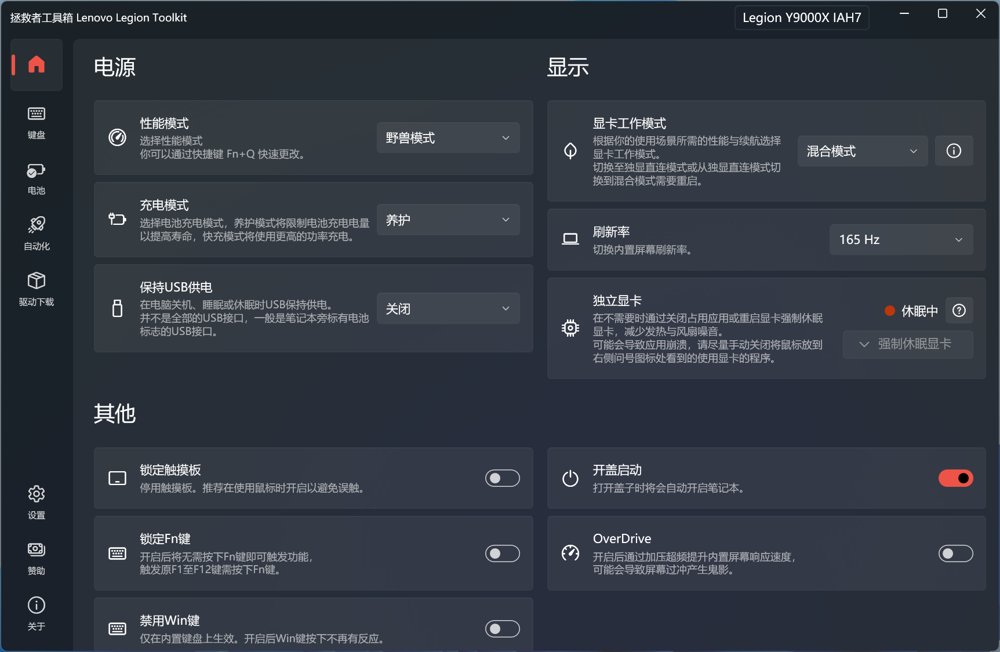

# 拯救者工具箱 Lenovo Legion Toolkit

---

联想拯救者工具箱 Lenovo Legion Toolkit (LLT) 是为联想拯救者系列笔记本打造的轻量化工具箱。可实现原来联想软件如 Lenovo Vantage、Legion Zone、联想电脑管家才可实现的功能。

**本软件仅适配拯救者系列及 Ideapad Gaming 系列，如果你是其他联想笔记本则这个软件不适合你，请不要提出兼容 Issue ，如果提出将被直接关闭不作受理。**

本软件不运行后台服务，使用较少的内存，几乎不使用 CPU ，并且不收集用户信息。本程序仅适用于 Windows 。

**加入拯救者工具箱中文交流反馈 QQ 频道，第一时间推送正式版/测试版更新并附带国内高速下载链接，用中文反馈问题并与其他用户交流。https://pd.qq.com/s/jj0737**

加入 Legion Series Discord: https://discord.com/invite/legionseries!

# 目录
  - [免责声明](#免责声明)
  - [赞助](#赞助)
  - [下载](#下载)
  - [兼容性](#兼容性)
  - [功能介绍](#功能介绍)
  - [贡献者](#贡献者)
  - [FAQ](#faq)
  - [如何开启记录Log](#如何开启记录Log)
  - [贡献此项目](#贡献此项目)

## 免责声明

**本软件非联想官方出品软件，使用需要自担风险。**

这是我的业余时间做的项目，我想让它适配更多的设备，但需要一些时间，所以请耐心等待并仔细阅读此自述文件。

## 赞助

开发不易，如果你觉得拯救者工具箱不错的话，可以考虑赞助以支持开发。

[使用PayPal赞助](https://www.paypal.com/donate/?hosted_button_id=22AZE2NBP3HTL)

#### 中国用户赞助

如果你居住在中国，可以使用Stripe来赞助。（支持支付宝与银联）

[使用Stripe赞助](https://donate.stripe.com/14k8yM94I980f3q7ss)

## 下载

你可以在这里下载最新版本：[Latest release](https://github.com/BartoszCichecki/LenovoLegionToolkit/releases/latest).

## 兼容性

拯救者工具箱兼容大部分 2020、2021 和 2022 款运行 Windows 10和 11 的拯救者与 Ideapad Gaming 系列笔记本。

建议在使用拯救者工具箱时禁用或卸载 Vantage、Hotkeys和Legion Zone 与联想电脑管家。当联想软件运行时可能会与拯救者工具箱产生冲突。

如果你在启动时看到不兼容弹窗，你可以查看底部的*贡献*部分，查看你能否帮助我适配你的机型。谨记我没有那么多的笔记本型号，所以一些功能我无法适配。

这里是测试过支持的型号 [Compatibility.cs](https://github.com/BartoszCichecki/LenovoLegionToolkit/blob/master/LenovoLegionToolkit.Lib/Utils/Compatibility.cs).

**拯救者系列与 Ideapad Gaming 系列之外的笔记本暂不考虑适配**

## 功能介绍

拯救者工具箱可以做到：

- 改变诸如性能模式、充电模式等只有通过 Lenovo Vantage、联想电脑管家才能更改的设置。
- 使用仅在 Legion Zone 中可用的自定义模式，包括2022款的调节风扇曲线和功耗控制。
- 支持调节四分区 RGB 键盘和白色背光的键盘。
- 改变显示器刷新率（仅内置显示器）。
- 强制休眠独立显卡（仅限英伟达显卡）。
- 查看电池统计数据。
- 下载、更新驱动。。
- 通过自动化实现插入/拔出充电器的自动操作。
- 无需卸载即可禁用 Lenovo Vantage、Legion Zone 和 Lenovo Hotkeys 服务。

##### 自定义模式

以下版本的 BIOS 支持自定义模式：
* GKCN49WW 和更高
* H1CN49WW 和更高
* HACN31WW 和更高
* HHCN23WW 和更高
* K1CN31WW 和更高
* J2CN40WW 和更高
* JUCN51WW 和更高
* JYCN39WW 和更高

并非所有设备都支持自定义模式的所有功能。

##### 强制休眠显卡

有时独立显卡会一直保持活动状态。例如在你插上外接显示器并断开后，一些进程会继续使用独显上运行，导致续航骤减。

在拯救者工具箱中有两种办法强制休眠显卡。

1. 强制关闭所有在独显上运行的进程。（这种方式貌似更有效）,
2. 短暂强制禁用独立显卡，使在独显上运行的进程全部切换到核显。

当独显处于活动状态，并使用混合模式且没有外接显示器到独显上时，强制休眠显卡才会亮起。如果你将鼠标悬停在右侧的问号标志上，将会看到独显的状态与正在使用独显的进程。

注意，强制休眠显卡可能会导致一些应用崩溃。

##### Windows电源计划

当切换性能模式时，拯救者工具箱会在 Lenovo Vantage 禁用的情况下自动切换 Windows 的电源计划。

但在一些笔记本上，Lenovo Vantage 不会切换电源计划。如果你的电脑不会自动切换电源计划，你可以在设置中设置不同性能模式对应的电源计划。这会让拯救者工具箱总是切换Windows电源计划即使 Lenovo Vantage 在后台运行。

##### CPU 睿频模式

此选项可以修改 Windows 电源计划中隐藏的调度设置—— CPU 睿频模式。这些选项很难看懂，但你可以查看微软的文档了解详情。

[处理器性能提升模式 @microsoft.com](https://docs.microsoft.com/zh-cn/windows-server/administration/performance-tuning/hardware/power/power-performance-tuning#processor-performance-boost-mode)

[ProcessorPerformanceBoostMode @microsoft.com](https://docs.microsoft.com/zh-cn/dotnet/api/microsoft.windows.eventtracing.power.processorperformanceboostmode?view=trace-processor-dotnet-1.0)

## 贡献者

特别感谢：

* [ViRb3](https://github.com/ViRb3) 创建了 [Lenovo Controller](https://github.com/ViRb3/LenovoController)，这是拯救者工具箱的基础。
* [falahati](https://github.com/falahati) 创建了 [NvAPIWrapper](https://github.com/falahati/NvAPIWrapper) 和 [WindowsDisplayAPI](https://github.com/falahati/WindowsDisplayAPI)
* [SmokelessCPU](https://github.com/SmokelessCPU) 帮助我适配了四分区 RGB 键盘背光。

翻译贡献者：
* 中文 - [凌卡Karl](https://github.com/KarlLee830), [DavidLogic](https://github.com/DavidLogic)
* 荷兰语 - Melm
* 罗马尼亚语 - [Mario Bălănică](https://github.com/mariobalanica)
* 西班牙语 - M.A.G.
* 葡萄牙语（巴西） - Vernon
* 俄语 - [Edward Johan](https://github.com/younyokel)
* 土耳其语 - Undervolt
* 乌克兰语 -  [Владислав «vaidee» Придатько](https://github.com/va1dee)
* 越南语 - Not_Nhan

## FAQ

#### 打开开机自启后拯救者工具箱没有开启自启？

拯救者工具箱是使用计划任务实现开机自启，这样可以使得开机自启时便有管理员权限。开机后延迟 30 秒（2.4.0 之前的版本是 1 分钟）自启动，以保证其他组件驱动已启动。如果你在开机看到桌面 1 分钟后仍然没有在托盘中看到拯救者工具箱的图标，请提交一个 Issue。

#### 更换主板后提示不兼容？

有时新主板内的机型和序列号信息出错，你可以尝试 [这篇教程](https://laptopwiki.eu/index.php/guides-and-tutorials/important-bios-related-guides/recover-original-model-sku-values/) 来恢复。如果这不起作用你可以尝试打开 `%LOCALAPPDATA%\LenovoLegionToolkit` 并创建一个名为 `args.txt` 的文件并打开文件后呼入 `--skip-compat-check` ，这会禁用拯救者工具箱的兼容性检查。我们建议你在无法正确恢复型号、序列号等信息的情况下再使用这个办法。

#### 支持哪些RGB？

目前仅支持白色背光键盘与四分区 RGB 键盘。

#### 支持 iCue RGB 键盘吗？

不支持，我推荐你看看 [OpenRGB](https://openrgb.org/) 这个项目。

#### 会支持 Legion Spectrum RGB Keyboard 吗？

我想要支持 Spectrum RGB 键盘，但我目前手头没有支持这个的设备。欢迎提交 PR！

#### 能不能多整一些 RGB 效果？

只有硬件支持的选项可用，不计划支持自定义效果。如果你想要自定义效果可以看看 [L5P-Keyboard-RGB](https://github.com/4JX/L5P-Keyboard-RGB) 或 [OpenRGB](https://openrgb.org/).

#### 2022 款之前的机器能否自定义调节风扇曲线？

如果你是 2022 款的拯救者不支持自定义风扇曲线请提交 Issue，我们会尝试适配。2022 款之前的机型由于技术原因无法支持。

#### 为什么我锁定 Fn 键后的效果是反的？

一些设备确实有这个问题，坦率地讲，我也不知道。但如果你知道解决欢迎贡献代码！

#### 为啥在启用 Legion AI 引擎后切换性能模式看起来似乎有些问题？

貌似有些 BIOS 版本在使用 Fn+Q 快捷键时有一个奇怪的问题，你可以试试更新 BIOS，除此之外只能等联想修复它了。

## 如何开启记录Log

在一些情况下如果你能提交应用记录的日志信息，将会对我调试和解决问题十分十分有用。

记录 Log 日志的步骤：

1. 确保拯救者工具箱已关闭（后台也记得关掉）；
2. 打开 `运行` （使用 Win + R 打开）然后输入 `"%LOCALAPPDATA%\Programs\LenovoLegionToolkit\Lenovo Legion Toolkit.exe" --trace` 然后点击确定；
3. 拯救者工具箱将会启动并且可以在左上角能看到 `[LOGGING ENABLED]` ；
4. 复现你遇到的问题；
5. 关闭拯救者工具箱 （同样记得关掉后台）；
6. 然后打开 `运行` （使用 Win + R 打开）然后输入 `"%LOCALAPPDATA%\LenovoLegionToolkit\log"` ；
7. 这里就是存放日志文件的地方了，提 Issue 时记得一并提交。

在 2.6.0 及以上版本有更快的开启记录日志的办法：

1. 确保拯救者工具箱已关闭（后台也记得关掉）；
2. 按住键盘左侧的 Ctrl 和 Shift；
3. 双击拯救者工具箱图标；
4. 拯救者工具箱将会启动并且可以在左上角能看到 `[LOGGING ENABLED]` 同时你会看到一个橙色的链接用来打开日志文件。

## 贡献此项目

我感谢你们提交的任何反馈！不要犹豫，直接提交 Issue。我们也欢迎提交 PR，但提交 PR 前务必查看 [CONTRIBUTING.md](CONTRIBUTING.md) 文件！

#### 翻译

我们已选择 Crowdin 为翻译平台。如果你想提交翻译请访问 https://crowdin.com/project/llt 并申请权限。

#### Bugs

如果你发现了软件中的任何Bug和问题，请报告。如果你附上日志将会对我们发现问题的根本原因十分有帮助。 你可以在 `%LOCALAPPDATA%\LenovoLegionToolkit\log` 找到日志文件。提交issue时记得附上最新的日志文件！

#### 适配

如果能适配更多设备就更好了！但要做到这点，我真的很需要你的帮助！

如果你愿意在未适配的机型上试试这个软件，请在启动时点击弹窗的继续按钮，拯救者工具箱会自动打开日志记录，这样你就可以在提交issue时提交了！

*注意一些功能可能无法正常运行*

如果你在 Github 上提交 Issue 并附上你的测试结果和日志我将十分感谢你！

请确保在你提交的 Issue 中包含以下信息：

1. 完整的设备型号 (Legion Y9000X 2022款 IAH7)
2. 正常工作的功能
3. 出错的功能
4. 会导致崩溃闪退的功能

你提交的信息越多，随着时间的推进，拯救者工具箱就会变得越来越好！如果有什么出错的地方请准确写下问题并附上日志。(日志保存地址 `%LOCALAPPDATA%\LenovoLegionToolkit\log`). 

万分感谢！
